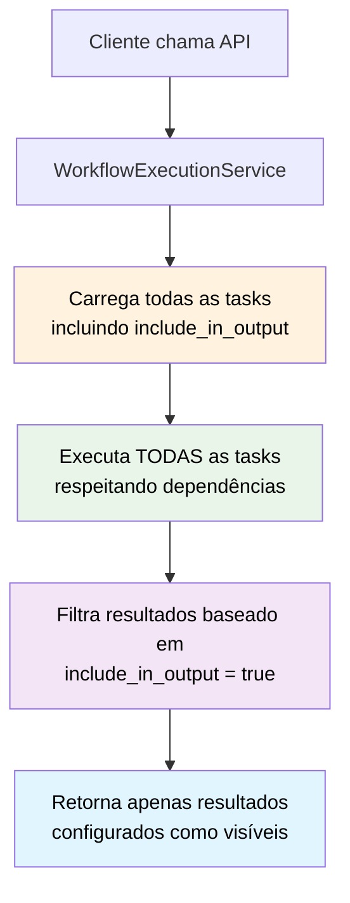

# 🎯 Configuração de Saída de Workflows

Esta funcionalidade permite configurar via banco de dados quais resultados de tasks devem ser retornados na resposta final da API, mantendo a execução de todas as tasks necessárias para dependências.

## 📋 Índice

1. [🎯 Problema Resolvido](#-problema-resolvido)
2. [🏗️ Arquitetura da Solução](#️-arquitetura-da-solução)
3. [💾 Modificações no Banco](#-modificações-no-banco)
4. [🔧 Como Configurar](#-como-configurar)
5. [📊 Exemplos Práticos](#-exemplos-práticos)
6. [🔍 Consultas de Verificação](#-consultas-de-verificação)
7. [⚡ Performance e Comportamento](#-performance-e-comportamento)

## 🎯 Problema Resolvido

### ❌ Antes (Problema)
```json
// API /workflows/IRU/execute retornava 16 resultados:
{
  "SERVIDAO_TOTAL": "resultado intermediário não útil para usuário",
  "AREA_IMOVEL_LIQUIDA": "resultado intermediário não útil para usuário", 
  "HIDRICO_IMOVEL": "resultado intermediário não útil para usuário",
  "MF": "resultado intermediário não útil para usuário",
  "MERGE": "resultado intermediário não útil para usuário",
  // ... mais 11 resultados intermediários
  "AREA_HA": "resultado final útil para o usuário"
}
```

### ✅ Depois (Solução)
```json
// API /workflows/IRU/execute retorna apenas 1 resultado:
{
  "AREA_HA": "{...todas as métricas calculadas em hectares...}"
}
```

**Benefícios:**
- ✅ **Todas as tasks são executadas** (dependências funcionam)
- ✅ **Apenas resultados úteis são retornados** (melhor UX)
- ✅ **Configurável por workflow** (flexibilidade)
- ✅ **Configurável por task** (granularidade)

## 🏗️ Arquitetura da Solução



### 🔄 Fluxo de Execução

1. **Carregamento**: Sistema carrega todas as tasks com suas configurações
2. **Execução Completa**: Todas as tasks são executadas (incluindo as ocultas)
3. **Filtragem**: Apenas results de tasks com `include_in_output = true` são incluídos
4. **Resposta**: API retorna apenas os resultados configurados como visíveis

## 💾 Modificações no Banco

### Nova Coluna na Tabela `workflow_task`

```sql
-- Adiciona controle de visibilidade de resultados
ALTER TABLE engine_configuration.workflow_task 
ADD COLUMN include_in_output BOOLEAN DEFAULT TRUE;
```

### Estrutura Atualizada

| Campo | Tipo | Descrição |
|-------|------|-----------|
| `id` | BIGSERIAL | ID único da task |
| `workflow_id` | BIGINT | ID do workflow |
| `spatial_function_id` | BIGINT | ID da função espacial |
| `task_alias` | VARCHAR(100) | Alias da task |
| `description` | TEXT | Descrição da task |
| `include_in_output` | **BOOLEAN** | **🆕 Controla se aparece na resposta da API** |
| `created_at` | TIMESTAMP | Data de criação |

## 🔧 Como Configurar

### Configuração por Workflow

```sql
-- Ocultar todas as tasks intermediárias de um workflow
UPDATE engine_configuration.workflow_task 
SET include_in_output = FALSE 
WHERE workflow_id = (SELECT id FROM engine_configuration.workflow WHERE name = 'IRU')
AND task_alias IN ('SERVIDAO_TOTAL', 'AREA_IMOVEL_LIQUIDA', 'MF', ...);

-- Mostrar apenas o resultado final
UPDATE engine_configuration.workflow_task 
SET include_in_output = TRUE 
WHERE workflow_id = (SELECT id FROM engine_configuration.workflow WHERE name = 'IRU')
AND task_alias = 'AREA_HA';
```

### Configuração por Task Individual

```sql
-- Ocultar uma task específica
UPDATE engine_configuration.workflow_task 
SET include_in_output = FALSE 
WHERE task_alias = 'SERVIDAO_TOTAL'
AND workflow_id = (SELECT id FROM engine_configuration.workflow WHERE name = 'IRU');

-- Mostrar uma task específica
UPDATE engine_configuration.workflow_task 
SET include_in_output = TRUE 
WHERE task_alias = 'AREA_HA'
AND workflow_id = (SELECT id FROM engine_configuration.workflow WHERE name = 'IRU');
```

## 📊 Exemplos Práticos

### Configurações Recomendadas por Workflow

#### 🔄 Workflow IRU (Complexo)
```sql
-- Estratégia: Apenas resultado final consolidado
-- Ocultar: 15 tasks intermediárias
-- Mostrar: 1 task final (AREA_HA)

-- Resultado da API: 1 objeto com todas as métricas
{
  "AREA_HA": "{area_total: 150.5, apps: {...}, servidao: {...}}"
}
```

#### ➡️ Workflow UF (Simples)
```sql
-- Estratégia: Mostrar o único resultado
-- Mostrar: 1 task (UF)

-- Resultado da API: 1 objeto com estado
{
  "UF": "MG"
}
```

#### 🔍 Workflow RESTRITA (Simples)
```sql
-- Estratégia: Mostrar análise de restrições
-- Mostrar: 1 task (AREAS_RESTRITAS)

-- Resultado da API: 1 objeto com sobreposições
{
  "AREAS_RESTRITAS": "{ti: [...], uc: [...]}"
}
```

### Configurações Alternativas

#### Modo Auditoria (IRU com Checkpoints)
```sql
-- Mostrar etapas principais para auditoria
UPDATE engine_configuration.workflow_task 
SET include_in_output = TRUE 
WHERE workflow_id = (SELECT id FROM engine_configuration.workflow WHERE name = 'IRU')
AND task_alias IN ('AREA_IMOVEL_LIQUIDA', 'APP_TOTAL', 'MERGE_APPs', 'AREA_HA');

-- Resultado da API: 4 objetos principais
{
  "AREA_IMOVEL_LIQUIDA": "...",
  "APP_TOTAL": "...",
  "MERGE_APPs": "...",
  "AREA_HA": "..."
}
```

#### Modo Debug (Todos os Resultados)
```sql
-- Mostrar todos os resultados para debugging
UPDATE engine_configuration.workflow_task 
SET include_in_output = TRUE 
WHERE workflow_id = (SELECT id FROM engine_configuration.workflow WHERE name = 'IRU');

-- Resultado da API: 16 objetos completos
{
  "SERVIDAO_TOTAL": "...",
  "AREA_IMOVEL_LIQUIDA": "...",
  // ... todos os 16 resultados
}
```

## 🔍 Consultas de Verificação

### Verificar Configuração Atual

```sql
-- Configuração detalhada por workflow
SELECT 
    w.name as workflow_name,
    wt.task_alias,
    wt.include_in_output,
    CASE 
        WHEN wt.include_in_output THEN '✅ Visível na API'
        ELSE '🔄 Oculto (mas executado)'
    END as status
FROM engine_configuration.workflow w
JOIN engine_configuration.workflow_task wt ON w.id = wt.workflow_id
WHERE w.active = true
ORDER BY w.name, wt.id;
```

### Resumo por Workflow

```sql
-- Estatísticas de configuração
SELECT 
    w.name as workflow_name,
    COUNT(*) as total_tasks,
    COUNT(CASE WHEN wt.include_in_output THEN 1 END) as tasks_visiveis,
    COUNT(CASE WHEN NOT wt.include_in_output THEN 1 END) as tasks_ocultas,
    ROUND(
        COUNT(CASE WHEN wt.include_in_output THEN 1 END) * 100.0 / COUNT(*), 
        1
    ) as percentual_visivel
FROM engine_configuration.workflow w
JOIN engine_configuration.workflow_task wt ON w.id = wt.workflow_id
WHERE w.active = true
GROUP BY w.id, w.name
ORDER BY w.name;
```

### Resultado Esperado

| workflow_name | total_tasks | tasks_visiveis | tasks_ocultas | percentual_visivel |
|---------------|-------------|----------------|---------------|-------------------|
| IRU           | 16          | 1              | 15            | 6.3%              |
| UF            | 1           | 1              | 0             | 100.0%            |
| RESTRITA      | 1           | 1              | 0             | 100.0%            |

## ⚡ Performance e Comportamento

### ✅ Garantias

1. **Execução Completa**: Todas as tasks são executadas independente da configuração
2. **Dependências Mantidas**: Tasks ocultas ainda fornecem dados para tasks dependentes
3. **Cache Preservado**: Cache interno funciona normalmente para todas as tasks
4. **Paralelismo Mantido**: Tasks independentes ainda executam em paralelo

### 📊 Impacto na Performance

#### Tempo de Execução
- ⏱️ **Execução**: Mesmo tempo (todas as tasks executam)
- 📤 **Resposta**: Menor payload (menos dados transferidos)
- 🔄 **Processamento**: Filtro adicional mínimo (~1-2ms)

#### Uso de Recursos
- 💾 **Memória**: Mesmo uso durante execução
- 🌐 **Rede**: Menor tráfego na resposta
- 🔄 **CPU**: Overhead mínimo para filtragem

### 📝 Logs de Execução

```
INFO - Executing 16 total tasks but will return only 1 tasks in response for workflow 'IRU'
INFO - Workflow 'IRU' execution completed successfully. Executed 16 tasks, returning 1 in response.
DEBUG - Tasks executed but hidden from output: SERVIDAO_TOTAL, AREA_IMOVEL_LIQUIDA, MF, ...
DEBUG - Tasks included in output: AREA_HA
```

## 🎛️ Configurações Avançadas

### Funções Auxiliares para Configuração

```sql
-- Função para configurar modo produção
CREATE OR REPLACE FUNCTION configure_workflow_production_mode(workflow_name TEXT)
RETURNS void AS $$
BEGIN
    -- Ocultar todos os intermediários
    UPDATE engine_configuration.workflow_task 
    SET include_in_output = FALSE
    WHERE workflow_id = (SELECT id FROM engine_configuration.workflow WHERE name = workflow_name);
    
    -- Mostrar apenas tasks finais (sink nodes)
    UPDATE engine_configuration.workflow_task 
    SET include_in_output = TRUE
    WHERE workflow_id = (SELECT id FROM engine_configuration.workflow WHERE name = workflow_name)
    AND id NOT IN (
        SELECT DISTINCT source_task_id 
        FROM engine_configuration.task_dependency 
        WHERE workflow_id = (SELECT id FROM engine_configuration.workflow WHERE name = workflow_name)
    );
END;
$$ LANGUAGE plpgsql;
```

### Uso das Funções

```sql
-- Configurar IRU para produção (apenas sink nodes)
SELECT configure_workflow_production_mode('IRU');

-- Configurar IRU para auditoria (checkpoints principais)
SELECT configure_workflow_audit_mode('IRU');

-- Configurar IRU para debug (todos os resultados)  
UPDATE engine_configuration.workflow_task 
SET include_in_output = TRUE 
WHERE workflow_id = (SELECT id FROM engine_configuration.workflow WHERE name = 'IRU');
```

## 🔧 Manutenção e Rollback

### Reverter para Comportamento Anterior

```sql
-- Mostrar todos os resultados (comportamento original)
UPDATE engine_configuration.workflow_task 
SET include_in_output = TRUE;
```

### Remover a Funcionalidade

```sql
-- Para rollback completo da funcionalidade
ALTER TABLE engine_configuration.workflow_task 
DROP COLUMN IF EXISTS include_in_output;
```

## 📚 Referências

- **Arquivo de Migração**: `src/main/resources/db_structure/calculator_engine/evolution_4.sql`
- **Modelo Atualizado**: `src/main/java/DPG/geo_calculation_engine/model/WorkflowTask.java`
- **Serviço Atualizado**: `src/main/java/DPG/geo_calculation_engine/service/WorkflowExecutionServiceImpl.java`
- **Script de Configuração**: `configure_workflow_output.sql`

---

**📞 Suporte**: Para dúvidas sobre configuração de workflows, consulte a equipe de desenvolvimento.
