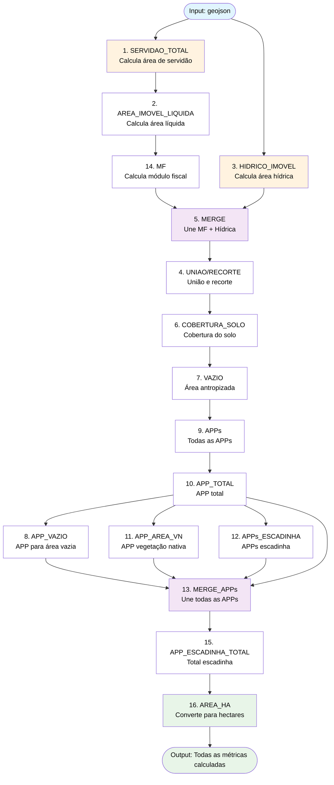
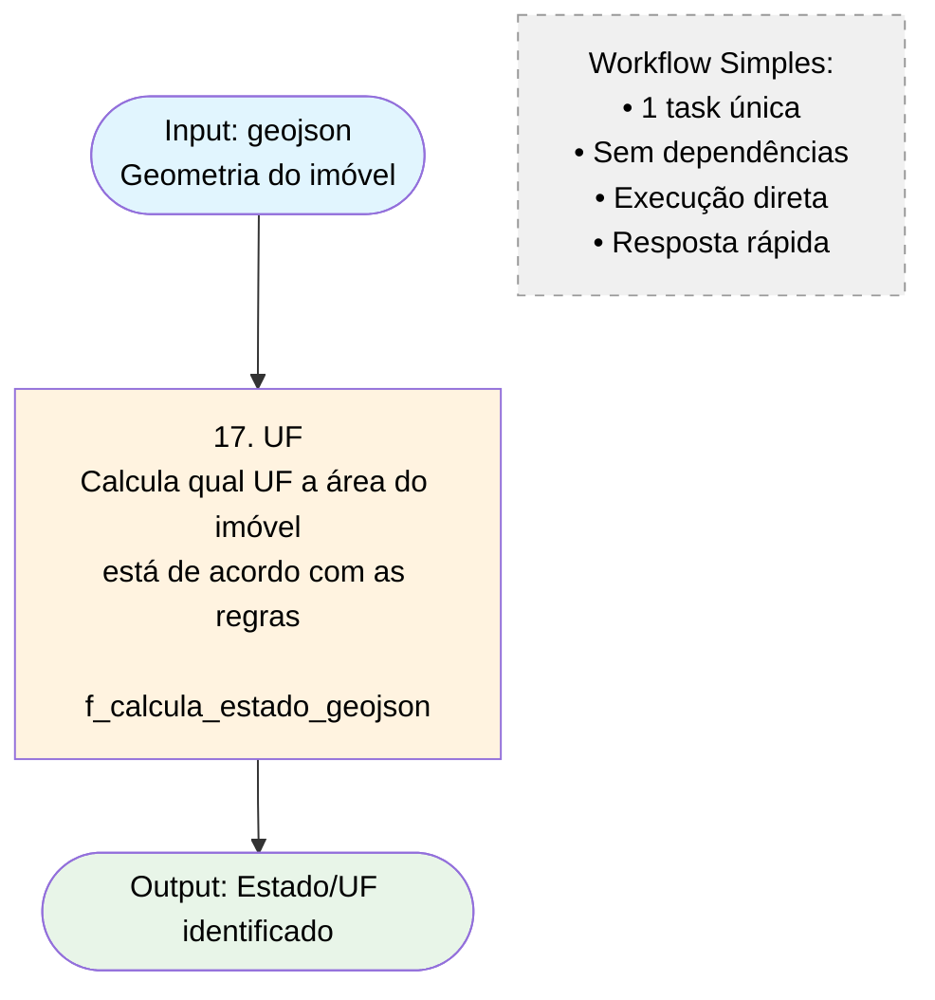
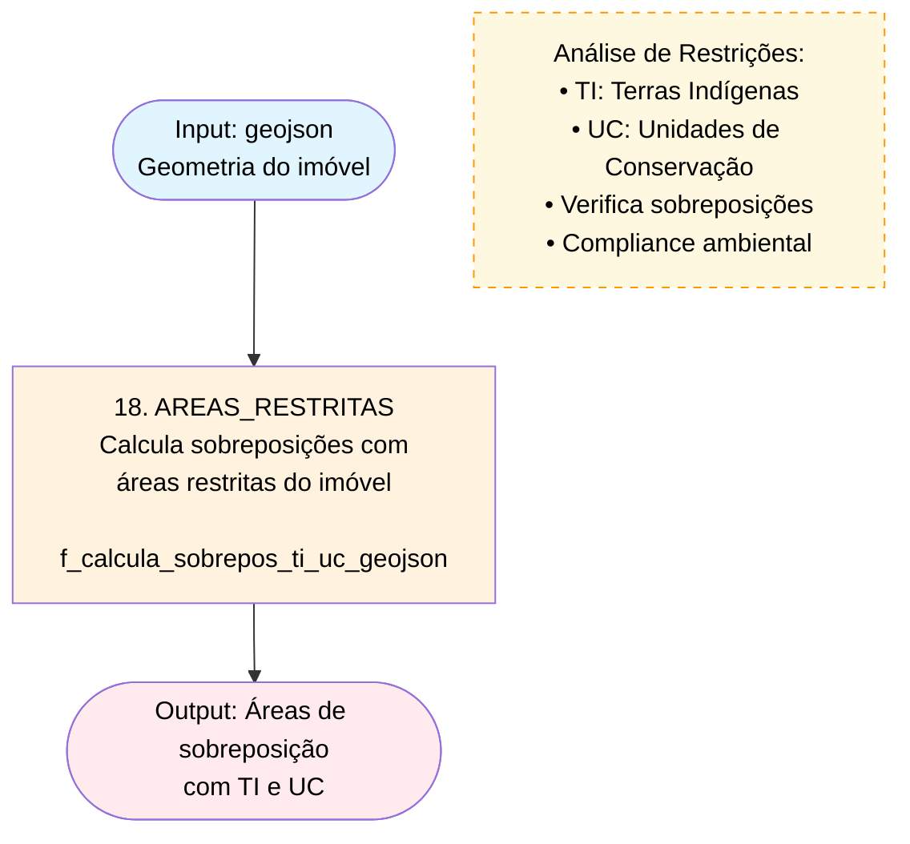

# Exemplos Práticos de Workflows - Motor de Cálculo Geoespacial

## Exemplo: Implementação do Conceito A(B,C)

Este documento demonstra como implementar na prática o conceito de dependências A(B,C), onde:
- **A** só pode ser executada após **B** e **C** serem concluídas
- **B** e **C** podem ser executadas em paralelo

## Cenário Real: Validação de Propriedade Rural

### Objetivo
Validar uma propriedade rural verificando:
- **B**: Se o buffer de 30m não invade áreas de preservação permanente
- **C**: Se a área total está dentro dos limites legais
- **A**: Calcular a intersecção final e gerar relatório de conformidade

### 1. Scripts SQL Completos

#### 1.1. Criar Funções Espaciais

```sql
-- Função B: Verificar sobreposição com APP
INSERT INTO engine_configuration.spatial_function (
    name, version, sql_definition, active, parameters
) VALUES (
    'check_app_overlap',
    1,
    'SELECT CASE 
        WHEN ST_Intersects(ST_Buffer(ST_GeomFromText($1), 30), ST_GeomFromText($2)) 
        THEN ST_AsText(ST_Intersection(ST_Buffer(ST_GeomFromText($1), 30), ST_GeomFromText($2)))
        ELSE ''No overlap''
     END as result',
    true,
    'property_wkt,app_wkt'
);

-- Função C: Validar área total
INSERT INTO engine_configuration.spatial_function (
    name, version, sql_definition, active, parameters
) VALUES (
    'validate_total_area',
    1,
    'SELECT CASE 
        WHEN ST_Area(ST_GeomFromText($1)) <= $2 
        THEN ''Valid area: '' || ST_Area(ST_GeomFromText($1))::text
        ELSE ''Exceeds limit: '' || ST_Area(ST_GeomFromText($1))::text
     END as result',
    true,
    'property_wkt,max_area'
);

-- Função A: Gerar relatório final
INSERT INTO engine_configuration.spatial_function (
    name, version, sql_definition, active, parameters
) VALUES (
    'generate_compliance_report',
    1,
    'SELECT json_build_object(
        ''property_area'', ST_Area(ST_GeomFromText($1)),
        ''app_check'', $2,
        ''area_check'', $3,
        ''compliance'', CASE 
            WHEN $2 = ''No overlap'' AND $3 LIKE ''Valid%'' 
            THEN ''APPROVED'' 
            ELSE ''REJECTED'' 
        END,
        ''timestamp'', now()
    )::text as result',
    true,
    'property_wkt,app_result,area_result'
);
```

#### 1.2. Criar Workflow

```sql
-- Workflow principal
INSERT INTO engine_configuration.workflow (
    name, description, active
) VALUES (
    'Rural_Property_Validation',
    'Validação completa de propriedade rural com verificação de APP e área',
    true
);
```

#### 1.3. Criar Tasks do Workflow

```sql
-- Task B: Verificar APP (pode executar em paralelo)
INSERT INTO engine_configuration.workflow_task (
    workflow_id, spatial_function_id, task_alias, description
) VALUES (
    1, 1, 'check_app_overlap', 'Verifica sobreposição com Área de Preservação Permanente'
);

-- Task C: Validar área (pode executar em paralelo)
INSERT INTO engine_configuration.workflow_task (
    workflow_id, spatial_function_id, task_alias, description
) VALUES (
    1, 2, 'validate_total_area', 'Valida se área total está dentro dos limites legais'
);

-- Task A: Relatório final (depende de B e C)
INSERT INTO engine_configuration.workflow_task (
    workflow_id, spatial_function_id, task_alias, description
) VALUES (
    1, 3, 'generate_compliance_report', 'Gera relatório final de conformidade'
);
```

#### 1.4. Definir Dependências A(B,C)

```sql
-- Dependência: Task B -> Task A
INSERT INTO engine_configuration.task_dependency (
    workflow_id, source_task_id, target_task_id, 
    source_output_alias, target_input_parameter
) VALUES (
    1, 1, 3, 'result', 'app_result'
);

-- Dependência: Task C -> Task A
INSERT INTO engine_configuration.task_dependency (
    workflow_id, source_task_id, target_task_id, 
    source_output_alias, target_input_parameter
) VALUES (
    1, 2, 3, 'result', 'area_result'
);
```

### 2. Consultas para Verificar a Estrutura

#### 2.1. Visualizar Workflow Completo

```sql
-- Consulta para ver o workflow completo
SELECT 
    w.name as workflow_name,
    wt.task_alias,
    sf.name as function_name,
    wt.description
FROM engine_configuration.workflow w
JOIN engine_configuration.workflow_task wt ON w.id = wt.workflow_id
JOIN engine_configuration.spatial_function sf ON wt.spatial_function_id = sf.id
WHERE w.name = 'Rural_Property_Validation'
ORDER BY wt.task_alias;
```

#### 2.2. Visualizar Dependências

```sql
-- Consulta para ver as dependências do workflow
SELECT 
    w.name as workflow_name,
    source_task.task_alias as source_task,
    target_task.task_alias as target_task,
    td.source_output_alias,
    td.target_input_parameter
FROM engine_configuration.task_dependency td
JOIN engine_configuration.workflow w ON td.workflow_id = w.id
JOIN engine_configuration.workflow_task source_task ON td.source_task_id = source_task.id
JOIN engine_configuration.workflow_task target_task ON td.target_task_id = target_task.id
WHERE w.name = 'Rural_Property_Validation';
```

### 3. Exemplo de Execução (Pseudocódigo)

```java
// Exemplo de como o motor executaria este workflow
public class WorkflowExecutionExample {
    
    public String executeWorkflow(String workflowName, Map<String, Object> inputs) {
        
        // 1. Analisar dependências
        List<Task> independentTasks = findTasksWithoutDependencies();
        // Resultado: [check_app_overlap, validate_total_area]
        
        // 2. Executar tarefas independentes em paralelo
        CompletableFuture<String> taskB = CompletableFuture.supplyAsync(() -> 
            executeTask("check_app_overlap", inputs)
        );
        
        CompletableFuture<String> taskC = CompletableFuture.supplyAsync(() -> 
            executeTask("validate_total_area", inputs)
        );
        
        // 3. Aguardar conclusão das dependências
        String appResult = taskB.get();    // "No overlap"
        String areaResult = taskC.get();   // "Valid area: 15000.5"
        
        // 4. Executar tarefa A com os resultados de B e C
        Map<String, Object> taskAInputs = new HashMap<>();
        taskAInputs.put("property_wkt", inputs.get("property_wkt"));
        taskAInputs.put("app_result", appResult);
        taskAInputs.put("area_result", areaResult);
        
        String finalResult = executeTask("generate_compliance_report", taskAInputs);
        
        return finalResult;
        // Resultado: {"property_area": 15000.5, "app_check": "No overlap", 
        //             "area_check": "Valid area: 15000.5", "compliance": "APPROVED"}
    }
}
```

### 4. Outros Exemplos de Padrões de Dependência

#### 4.1. Cadeia Linear: A -> B -> C

```sql
-- Task A executa primeiro
-- Task B depende de A
-- Task C depende de B

INSERT INTO engine_configuration.task_dependency (
    workflow_id, source_task_id, target_task_id, 
    source_output_alias, target_input_parameter
) VALUES 
(2, 1, 2, 'result', 'input_from_a'),  -- A -> B
(2, 2, 3, 'result', 'input_from_b');  -- B -> C
```

#### 4.2. Convergência: (A,B) -> C -> D

```sql
-- A e B executam em paralelo
-- C depende de A e B
-- D depende de C

INSERT INTO engine_configuration.task_dependency (
    workflow_id, source_task_id, target_task_id, 
    source_output_alias, target_input_parameter
) VALUES 
(3, 1, 3, 'result', 'input_from_a'),  -- A -> C
(3, 2, 3, 'result', 'input_from_b'),  -- B -> C
(3, 3, 4, 'result', 'input_from_c');  -- C -> D
```

#### 4.3. Divergência: A -> (B,C,D)

```sql
-- A executa primeiro
-- B, C, D dependem de A e podem executar em paralelo

INSERT INTO engine_configuration.task_dependency (
    workflow_id, source_task_id, target_task_id, 
    source_output_alias, target_input_parameter
) VALUES 
(4, 1, 2, 'result', 'input_from_a'),  -- A -> B
(4, 1, 3, 'result', 'input_from_a'),  -- A -> C
(4, 1, 4, 'result', 'input_from_a');  -- A -> D
```

### 5. Configuração de Camadas para o Exemplo

```sql
-- Camada para propriedades rurais
INSERT INTO engine_configuration.layer (
    name, geometry_type, group_name, allow_overlap, 
    generate_buffer, buffer_size, calculate_area, active
) VALUES (
    'Rural_Property',
    'POLYGON',
    'Land_Registry',
    false,
    true,
    30.0,  -- Buffer de 30m
    true,
    true
);

-- Camada para Áreas de Preservação Permanente
INSERT INTO engine_configuration.layer (
    name, geometry_type, group_name, allow_overlap, 
    overlap_restrictions, calculate_area, active
) VALUES (
    'APP_Areas',
    'POLYGON',
    'Environmental',
    false,
    '[1]',  -- Não pode sobrepor à camada 1 (Rural_Property)
    true,
    true
);
```

### 6. Payload de Exemplo para Execução

```json
{
    "workflowName": "Rural_Property_Validation",
    "inputs": {
        "property_wkt": "POLYGON((-47.123 -15.456, -47.120 -15.456, -47.120 -15.453, -47.123 -15.453, -47.123 -15.456))",
        "app_wkt": "POLYGON((-47.125 -15.458, -47.118 -15.458, -47.118 -15.451, -47.125 -15.451, -47.125 -15.458))",
        "max_area": 20000.0
    }
}
```

### 7. Resultado Esperado

```json
{
    "status": "SUCCESS",
    "workflowId": "Rural_Property_Validation",
    "executionTime": "1.234s",
    "tasksExecuted": [
        {
            "taskAlias": "check_app_overlap",
            "status": "COMPLETED",
            "executionOrder": 1,
            "result": "No overlap"
        },
        {
            "taskAlias": "validate_total_area", 
            "status": "COMPLETED",
            "executionOrder": 1,
            "result": "Valid area: 15000.5"
        },
        {
            "taskAlias": "generate_compliance_report",
            "status": "COMPLETED", 
            "executionOrder": 2,
            "result": "{\"property_area\": 15000.5, \"app_check\": \"No overlap\", \"area_check\": \"Valid area: 15000.5\", \"compliance\": \"APPROVED\", \"timestamp\": \"2024-01-15T10:30:00Z\"}"
        }
    ],
    "finalResult": {
        "property_area": 15000.5,
        "app_check": "No overlap", 
        "area_check": "Valid area: 15000.5",
        "compliance": "APPROVED",
        "timestamp": "2024-01-15T10:30:00Z"
    }
}
```

## Benefícios da Arquitetura

1. **Paralelização**: Tasks B e C executam simultaneamente, reduzindo tempo total
2. **Flexibilidade**: Fácil adição de novas validações sem afetar as existentes
3. **Reutilização**: Funções espaciais podem ser reutilizadas em outros workflows
4. **Versionamento**: Permite evolução das funções sem quebrar workflows existentes
5. **Rastreabilidade**: Cada execução é logada com resultados intermediários

## Monitoramento e Debug

```sql
-- Query para monitorar execuções ativas
SELECT 
    w.name,
    COUNT(wt.id) as total_tasks,
    COUNT(CASE WHEN td.target_task_id IS NULL THEN 1 END) as independent_tasks
FROM engine_configuration.workflow w
JOIN engine_configuration.workflow_task wt ON w.id = wt.workflow_id
LEFT JOIN engine_configuration.task_dependency td ON wt.id = td.target_task_id
WHERE w.active = true
GROUP BY w.id, w.name;
```

## 📊 Diagramas de Ordem de Execução dos Workflows

Esta seção apresenta os diagramas visuais da ordem de execução dos workflows implementados no sistema, mostrando o fluxo de dependências e execução das tasks.

### 🔄 Workflow IRU - Cálculos Completos para Imóveis Rurais

O workflow IRU é o mais complexo do sistema, com 16 tasks e 21 dependências, realizando cálculos completos para análise de imóveis rurais.



**Características do Workflow IRU:**
- **Paralelismo Inicial**: Tasks 1 (SERVIDAO_TOTAL) e 3 (HIDRICO_IMOVEL) executam simultaneamente
- **Convergência no MERGE**: Resultados se unem na task 5 (MERGE)
- **Sequência de APPs**: Cadeia complexa de cálculos de Áreas de Preservação Permanente
- **Paralelismo de APPs**: Tasks 8, 11 e 12 executam em paralelo após task 10
- **Resultado Final**: Todas as métricas calculadas em hectares

### ➡️ Workflow UF - Identificação de Unidade Federativa

Workflow simples para identificar qual estado/UF o imóvel pertence.



**Características do Workflow UF:**
- **Execução Direta**: Input → Processamento → Output
- **Sem Dependências**: Não há tasks prerequisitas
- **Função Específica**: Análise geográfica de localização
- **Performance**: Resposta rápida e eficiente

### 🔍 Workflow RESTRITA - Análise de Áreas Restritas

Workflow para verificar sobreposições com Terras Indígenas e Unidades de Conservação.



**Características do Workflow RESTRITA:**
- **Compliance Ambiental**: Verificação de conformidade legal
- **Análise de Sobreposição**: Detecta conflitos com áreas protegidas
- **TI e UC**: Terras Indígenas e Unidades de Conservação
- **Resultado Crítico**: Informação essencial para aprovação de projetos

### 📋 Comparativo dos Workflows

| Aspecto | IRU | UF | RESTRITA |
|---------|-----|----| ---------|
| **Complexidade** | Alta (16 tasks) | Baixa (1 task) | Baixa (1 task) |
| **Dependências** | 21 dependências | 0 dependências | 0 dependências |
| **Paralelismo** | Sim (2 pontos) | Não | Não |
| **Tempo de Execução** | Alto | Baixo | Baixo |
| **Tipo de Análise** | Completa | Localização | Compliance |
| **Casos de Uso** | Licenciamento completo | Consulta rápida | Verificação legal |

### 🎯 Recomendações de Uso

#### Workflow IRU
- **Quando usar**: Análise completa de propriedades rurais
- **Tempo esperado**: 5-15 segundos (dependendo da complexidade da geometria)
- **Recursos necessários**: Alto processamento, múltiplas consultas PostGIS

#### Workflow UF
- **Quando usar**: Identificação rápida de localização
- **Tempo esperado**: < 1 segundo
- **Recursos necessários**: Mínimo, consulta simples

#### Workflow RESTRITA
- **Quando usar**: Verificação de compliance antes de aprovações
- **Tempo esperado**: 1-3 segundos
- **Recursos necessários**: Médio, consulta de sobreposição espacial

### 🔧 Otimizações Implementadas

1. **Cache de Resultados**: Evita recomputação de tasks já executadas
2. **Execução Paralela**: Tasks independentes executam simultaneamente
3. **Lazy Loading**: Tasks só são executadas quando suas dependências estão prontas
4. **Thread Safety**: Gerenciamento seguro de cache para execução concorrente 